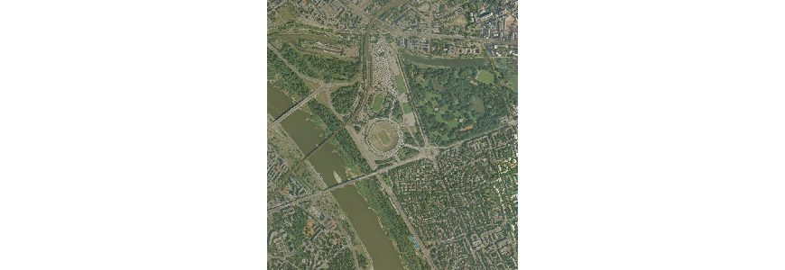
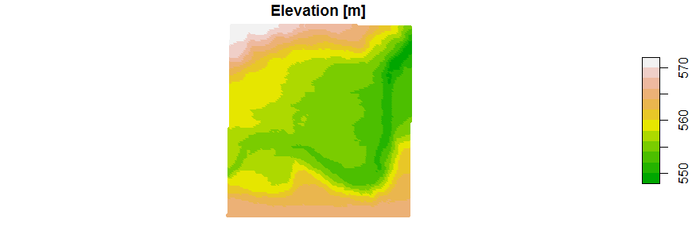

# rgugik

**rgugik** is an R package for downloading open data from resources of [Polish Head Office of Geodesy and Cartography](http://www.gugik.gov.pl/).
Currently you can download:
  - [orthophotomap](http://www.gugik.gov.pl/pzgik/zamow-dane/ortofotomapa),
  - [Digital Terrain Model](http://www.gugik.gov.pl/pzgik/zamow-dane/numeryczny-model-terenu) as XYZ vector points, 1 m resolution.
  
## Usage

### Ortophotomap:
  
`orto_request` - returns a data frame with metadata and links to download orthoimages.
  
`orto_download` - downloads orthoimages from a data frame from `orto_request` function.
  
```r
library("sf")
library("raster")

polygon = read_sf("polygon.gpkg")
req_df = orto_request(polygon)

str(req_df1)
#> 'data.frame':    14 obs. of  9 variables:
#> $ godlo          : chr  "N-34-139-A-c-1-2" "N-34-139-A-c-1-2" "N-34-139-A-c-1-2" "N-34-139-A-c-1" ...
#> $ akt_rok        : int  2007 2011 2011 2001 2013 2013 2013 2017 2017 2017 ...
#> $ piksel         : num  0.5 0.25 0.25 0.75 0.1 0.1 0.1 0.25 0.25 0.25 ...
#> $ kolor          : chr  "RGB" "CIR" "RGB" "RGB" ...
#> $ zrDanych       : chr  "Zdj. analogowe" "Zdj. cyfrowe" "Zdj. cyfrowe" "Zdj. analogowe" ...
#> $ url_do_pobrania: chr  "https://opendata.geoportal.gov.pl/ortofotomapa/43/43_67170_N-34-139-A-c-1-2.tif" ...
#> $ idSerie        : int  43 69755 130 23 258 64969 64969 69931 69932 66672 ...
#> $ sha1           : chr  "df6ffeb93225bf578085b52c96e3bc78df129e7d" ...
#> $ nazwa_pliku    : chr  "43_67170_N-34-139-A-c-1-2" "69755_140758_N-34-139-A-c-1-2" ...

orto_download(req_df[1, ]) # download only first image

img = brick("43_67170_N-34-139-A-c-1-2.tif")
plotRGB(img)
```


### DTM (as XYZ):

```r
library("sf")
polygon = read_sf("polygon.gpkg")
DTM = pointDTM_get(polygon)

summary(DTM$elev)
#>   Min. 1st Qu.  Median    Mean 3rd Qu.    Max. 
#>  548.7   554.8   557.4   558.2   561.4   571.5 

plot(DTM, pal = terrain.colors, pch = 20, main = "Elevation [m]")
```

