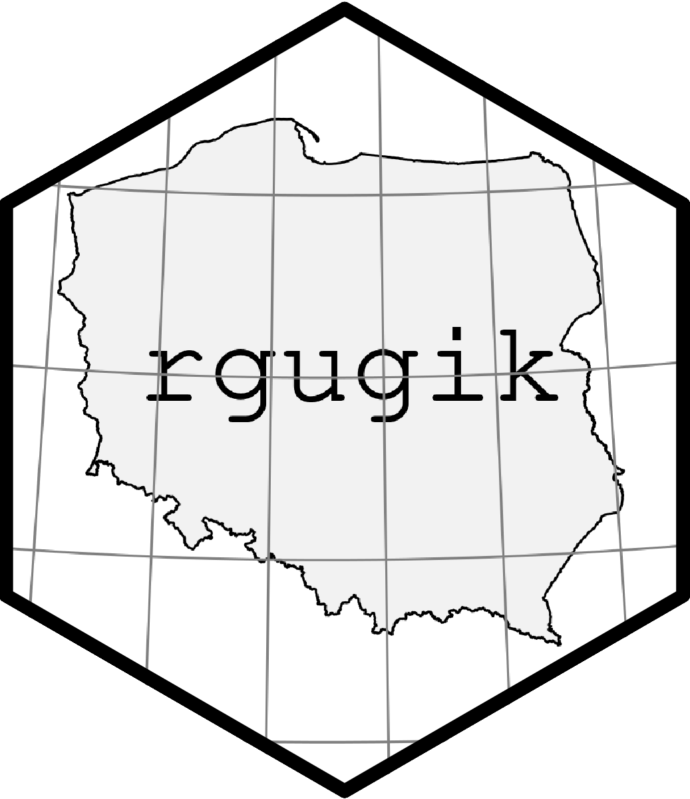
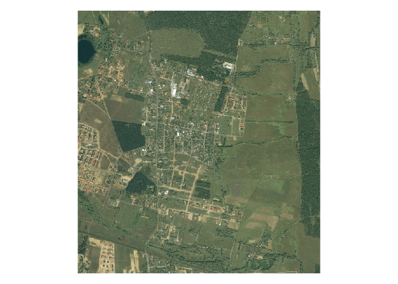
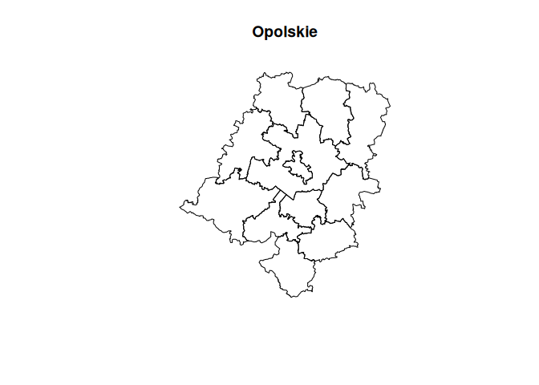

<!-- README.md is generated from README.Rmd. Please edit that file -->

# rgugik 

<!-- badges: start -->

[](https://cran.r-project.org/package=rgugik)
[](https://github.com/kadyb/rgugik/actions)
[](https://codecov.io/gh/kadyb/rgugik)
[](https://opensource.org/licenses/MIT)
[](https://doi.org/10.21105/joss.02948)
<!-- badges: end -->

**rgugik** is an R package for downloading open data from resources of
[Polish Head Office of Geodesy and Cartography](http://www.gugik.gov.pl)
including:

-   [Orthophotomaps](http://www.gugik.gov.pl/pzgik/zamow-dane/ortofotomapa)
-   [General Geographic
    Database](http://www.gugik.gov.pl/pzgik/zamow-dane/baza-danych-obiektow-ogolnogeograficznych)
-   [Topographic
    Database](http://www.gugik.gov.pl/pzgik/zamow-dane/baza-danych-obiektow-topograficznych-bdot-10k)
-   [Register of Towns, Streets and
    Addresses](https://emuia.gugik.gov.pl)
-   [State Register of Geographical
    Names](https://www.geoportal.gov.pl/dane/panstwowy-rejestr-nazw-geograficznych)
-   [State Register of
    Borders](http://www.gugik.gov.pl/pzgik/zamow-dane/panstwowy-rejestr-granic-i-powierzchni-jednostek-podzialow-terytorialnych-kraju)
-   Location (geometry) of cadastral parcels using TERYT (parcel ID) or
    coordinates
-   3D models of buildings (LOD1, LOD2)
-   Various digital elevation models as:
    -   [Digital terrain
        model](http://www.gugik.gov.pl/pzgik/zamow-dane/numeryczny-model-terenu)
    -   [Digital surface
        model](http://www.gugik.gov.pl/pzgik/zamow-dane/numeryczny-model-pokrycia-terenu)
    -   [Point
        cloud](http://www.gugik.gov.pl/pzgik/zamow-dane/dane-pomiarowe)

It is also possible to geocode addresses or objects using the
`geocodePL_get()` function.

**Corresponding functions**

| Function                              | Input                  | Dastaset EN                              | Dataset PL                                |
|:--------------------------------------|:-----------------------|:-----------------------------------------|:------------------------------------------|
| `ortho_request()`, `tile_download()`  | geometry               | Orthophotomap                            | Ortofotomapa                              |
| `geodb_download()`                    | voivodeship            | General Geographic Database              | Baza Danych Obiektów Ogólnogeograficznych |
| `topodb_download()`                   | county                 | Topographic Database                     | Baza Danych Obiektów Topograficznych      |
| `emuia_download()`                    | commune                | Register of Towns, Streets and Addresses | Ewidencja Miejscowości, Ulic i Adresów    |
| `geonames_download()`                 | type                   | State Register of Geographical Names     | Państwowy Rejestr Nazw Geograficznych     |
| `borders_get()`, `borders_download()` | type                   | State Register of Borders                | Państwowy Rejestr Granic                  |
| `parcel_get()`                        | parcel ID, coordinates | Location of cadastral parcels            | Lokalizacja działek katastralnych         |
| `models3D_download()`                 | county                 | 3D models of buildings                   | Modele 3D budynków                        |
| `DEM_request()`, `tile_download()`    | geometry               | Digital elevation models                 | Cyfrowe modele wysokościowe               |

There are the additional functions for obtaining digital terrain model:

-   `pointDTM_get()` for small areas (high resolution grid)
-   `pointDTM100_download()` for voivodeships areas (low resolution
    grid)
-   `minmaxDTM_get()` to find the minimum and maximum elevation (small
    areas)

The names of administrative units and their IDs can be obtained using
these functions:

-   `voivodeship_names()` (16)
-   `county_names()` (380)
-   `commune_names()` (2477)

## Installation

You can install the released version from
[CRAN](https://cran.r-project.org/) with:

``` r
install.packages("rgugik")
```

You can install the development version from
[GitHub](https://github.com) with:

``` r
# install.packages("remotes")
remotes::install_github("kadyb/rgugik")
```

## Usage

### Orthophotomap

-   `ortho_request()` - returns a data frame with metadata and links to
    the orthoimages for a given geometry (point, line or polygon)
-   `tile_download()` - downloads orthoimages based on the data frame
    obtained using the `ortho_request()` function

``` r
library(rgugik)
library(sf)
library(raster)

polygon_path = system.file("datasets/search_area.gpkg", package = "rgugik")
polygon = read_sf(polygon_path)

req_df = ortho_request(polygon)

# select the oldest image
req_df = req_df[req_df$year == 2001, ]

# print metadata
t(req_df)
#>             17                                                                              
#> sheetID     "N-33-130-D-b-2-3"                                                              
#> year        "2001"                                                                          
#> resolution  "1"                                                                             
#> composition "RGB"                                                                           
#> sensor      "Satellite"                                                                     
#> CRS         "PL-1992"                                                                       
#> isFilled    "TRUE"                                                                          
#> URL         "https://opendata.geoportal.gov.pl/ortofotomapa/41/41_3756_N-33-130-D-b-2-3.tif"
#> seriesID    "41"                                                                            
#> sha1        "312c81963a31e268fc20c442733c48e1aa33838f"                                      
#> date        "2001-01-01"                                                                    
#> filename    "41_3756_N-33-130-D-b-2-3"

# download image
tile_download(req_df)
#> 1/1

img = brick("41_3756_N-33-130-D-b-2-3.tif")
plotRGB(img)
```



### Administrative boundaries

``` r
library(rgugik)
library(sf)

# get counties from opolskie voivodeship (TERYT 16)
counties = county_names
counties = counties[substr(counties$TERYT, 1, 2) == "16", "TERYT"]
counties_geom = borders_get(TERYT = counties)
plot(st_geometry(counties_geom), main = "Opolskie")
```



### Vignettes

More advanced examples of the practical (step by step) use of this
package can be found in the vignettes:

-   [Orthophotomap](https://kadyb.github.io/rgugik/articles/orthophotomap.html)
-   [Digital elevation
    model](https://kadyb.github.io/rgugik/articles/DEM.html)
-   [Topographic
    Database](https://kadyb.github.io/rgugik/articles/topodb.html)

## Acknowledgment

[Head Office of Geodesy and Cartography in
Poland](http://www.gugik.gov.pl/) is the main source of the provided
data. The data is made available in accordance with the [Act of May 17,
1989 Geodetic and Cartographic
Law](http://isap.sejm.gov.pl/isap.nsf/DocDetails.xsp?id=WDU19890300163)
(amended on 16 April 2020).

All datasets can be explored interactively using the
[Geoportal](https://mapy.geoportal.gov.pl).

## Contribution

Contributions to this package are welcome. The preferred method of
contribution is through a GitHub pull request. Feel also free to contact
us by creating [an issue](https://github.com/kadyb/rgugik/issues). More
detailed information can be found in the
[CONTRIBUTING](https://github.com/kadyb/rgugik/blob/master/CONTRIBUTING.md)
document.

Maintainers and contributors must follow this repository’s [CODE OF
CONDUCT](https://github.com/kadyb/rgugik/blob/master/CODE_OF_CONDUCT.md).

## Citation

To cite **rgugik** in publications, please use the following
[article](https://doi.org/10.21105/joss.02948):

    Dyba, K. and Nowosad, J. (2021). rgugik: Search and Retrieve Spatial Data from the Polish Head Office of Geodesy and Cartography in R. Journal of Open Source Software, 6(59), 2948, https://doi.org/10.21105/joss.02948

BibTeX version can be obtained with `citation("rgugik")`.

## Related projects

If you don’t feel familiar with R, there is a similar
[QGIS](https://www.qgis.org/en/site/) tool in the
[EnviroSolutions](https://github.com/envirosolutionspl) repository.
