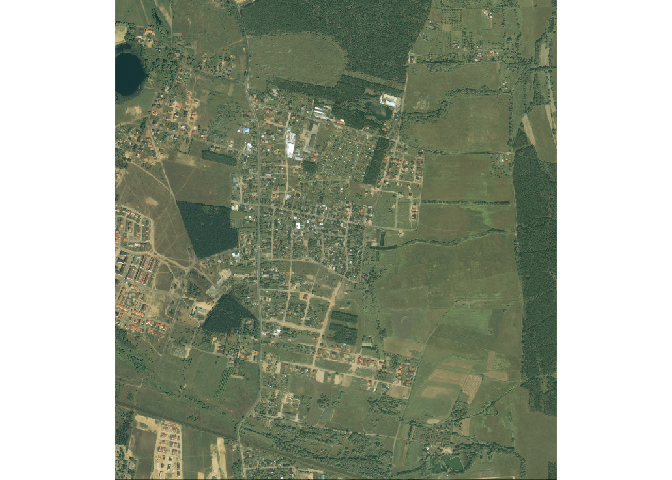
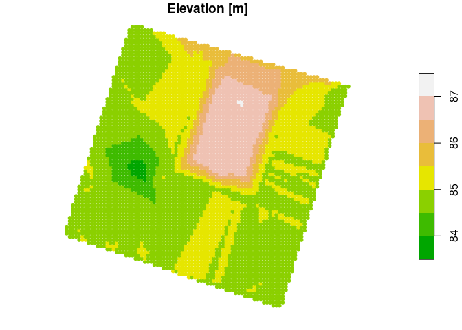

<!-- README.md is generated from README.Rmd. Please edit that file -->

# rgugik

<!-- badges: start -->

[](https://github.com/kadyb/rgugik/actions)
<!-- badges: end -->

**rgugik** is an R package for downloading open data from resources of
[Polish Head Office of Geodesy and
Cartography](http://www.gugik.gov.pl). Currently you can download:

  - [Orthophotomaps](http://www.gugik.gov.pl/pzgik/zamow-dane/ortofotomapa)
  - [General Geographic
    Database](http://www.gugik.gov.pl/pzgik/zamow-dane/baza-danych-obiektow-ogolnogeograficznych)
  - [State Register of Geographical
    Names](http://www.gugik.gov.pl/pzgik/zamow-dane/panstwowy-rejestr-nazw-geograficznych)
  - Location (geometry) of cadastral parcels using TERYT (parcel ID) or
    coordinates
  - 3D models of buildings (LOD1, LOD2)
  - Various Digital Elevation Models as:
      - [Digital Terrain
        Model](http://www.gugik.gov.pl/pzgik/zamow-dane/numeryczny-model-terenu)
      - [Digital Surface
        Model](http://www.gugik.gov.pl/pzgik/zamow-dane/numeryczny-model-pokrycia-terenu)
      - [Point
        Cloud](http://www.gugik.gov.pl/pzgik/zamow-dane/dane-pomiarowe)
  - \*Digital Terrain Model as vector points with 1 m resolution and as
    text files with 100 m resolution for entire voivodeships

It is also possible to geocode addresses or objects using the
`geocodePL_get()` function.

**Corresponding functions**

| Function                                   | Input                  | Dastaset EN                          | Dataset PL                                |
| :----------------------------------------- | :--------------------- | :----------------------------------- | :---------------------------------------- |
| `orto_request()`, `tile_download()`        | polygon                | Orthophotomap                        | Ortofotomapa                              |
| `geodb_download()`                         | voivodeship            | General Geographic Database          | Baza Danych Obiektów Ogólnogeograficznych |
| `geonames_download()`                      | place, object          | State Register of Geographical Names | Państwowy Rejestr Nazw Geograficznych     |
| `parcel_get()`                             | parcel ID, coordinates | Location of cadastral parcels        | Lokalizacja działek katastralnych         |
| `models3D_download()`                      | county                 | 3D models of buildings               | Modele 3D budynków                        |
| `DEM_request()`, `tile_download()`         | polygon                | Digital Elevation Models             | Cyfrowe Modele Wysokościowe               |
| `pointDTM_get()`, `pointDTM100_download()` | polygon, voivodeship   | \*Digital Terrain Model              | \*Numeryczny Model Terenu                 |

## Installation

<!-- You can install the released version of rgugik from [CRAN](https://CRAN.R-project.org) with: -->

<!-- ``` r -->

<!-- install.packages("rgugik") -->

<!-- ``` -->

You can install the development version from
[GitHub](https://github.com) with:

``` r
# install.packages("remotes")
remotes::install_github("kadyb/rgugik")
```

## Usage

### Ortophotomap

  - `orto_request()` - returns a data frame with metadata and links to
    the orthoimages in a given polygon
  - `tile_download()` - downloads orthoimages based on the data frame
    obtained using the `orto_request()` function

<!-- end list -->

``` r
library(rgugik)
library(sf)
library(raster)

polygon_path = system.file("datasets/search_area.gpkg", package = "rgugik")
polygon = read_sf(polygon_path)

req_df = orto_request(polygon)

# show metadata and download the first image only
t(req_df[1, ])
#>             1                                                                               
#> sheetID     "N-33-130-D-b-2-3"                                                              
#> year        "2001"                                                                          
#> resolution  "1"                                                                             
#> composition "RGB"                                                                           
#> sensor      "Satellite"                                                                     
#> CRS         "PL-1992"                                                                       
#> isFilled    "TRUE"                                                                          
#> URL         "https://opendata.geoportal.gov.pl/ortofotomapa/41/41_3756_N-33-130-D-b-2-3.tif"
#> seriesID    "41"                                                                            
#> sha1        "312c81963a31e268fc20c442733c48e1aa33838f"                                      
#> filename    "41_3756_N-33-130-D-b-2-3"
tile_download(req_df[1, ])

img = brick("41_3756_N-33-130-D-b-2-3.tif")
plotRGB(img)
```



### DTM (as XYZ)

``` r
library(rgugik)
library(sf)

polygon_path = system.file("datasets/search_area.gpkg", package = "rgugik")
polygon = read_sf(polygon_path)

DTM = pointDTM_get(polygon)
#> 0/10
#> 1/10
#> 2/10
#> 3/10
#> 4/10
#> 5/10
#> 6/10
#> 7/10
#> 8/10
#> 9/10
#> 10/10

plot(DTM, pal = terrain.colors, pch = 20, main = "Elevation [m]")
```



## Acknowledgment

[Head Office of Geodesy and Cartography in
Poland](http://www.gugik.gov.pl/) is the main source of the data. The
data is made available in accordance with the [Act of May 17, 1989
Geodetic and Cartographic
Law](http://isap.sejm.gov.pl/isap.nsf/DocDetails.xsp?id=WDU19890300163)
(amended on 16 April 2020).

The main source of spatial data in Poland is the
[Geoportal](https://mapy.geoportal.gov.pl).

## Contribution

Contributions to this package are welcome. The preferred method of
contribution is through a GitHub pull request. Feel also free to contact
us by creating [an issue](https://github.com/kadyb/rgugik/issues).

## Related projects

If you don’t feel familiar with R, there is a similar
[QGIS](https://www.qgis.org) tool in the
[EnviroSolutions](https://github.com/envirosolutionspl) repository.
