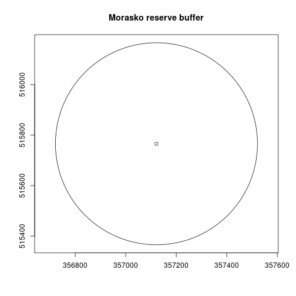
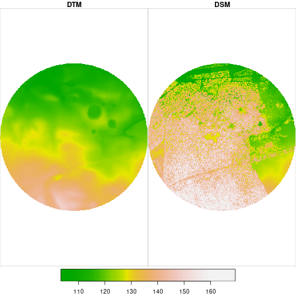
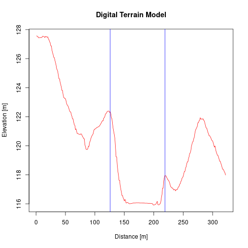
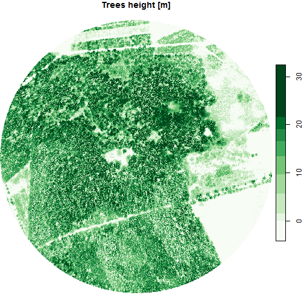

<style>
body {text-align: justify}
</style>

## Definition

**Digital Elevation Models** are models that describe the terrain surface.
They are created as a result of the processing of aerial photos, laser scanning (LiDAR), geodetic surveying or radar interferometry (InSAR).
DEMs are one of the key datasets in Geographic Information Systems (GIS) and constitute the basis for environmental spatial analyses.
In addition, they are a source for derived products such as terrain slope and exposure.
DEM is the general name for a group of models with different characteristics, including:

1. **Digital Terrain Model** (DTM) - numerical representation of the terrain with its morphological forms.
This model is devoid of any objects above the ground, such as buildings or trees.
2. **Digital Surface Model** (DSM) - numerical representation of the terrain, including objects on its surface, such as buildings and trees.

<center> { width=50% } </center>

The properties of the DEMs:

1. Format - we can distinguish three structures: **GRID** (point / cell), **TIN** (irregular topological triangle network) and **contour lines** (vector).
Currently, the most used format is GRID.
2. Accuracy - is related to the vertical measurement error.
3. Spatial resolution - is related to the size of the smallest object that can be detected by the sensor and is determined by the size of the image cell (pixel).
The larger the cell, the more generalized form of the terrain it presents.

## Purpose

The purpose of this exercise is to determine the elevation of the ground surface and objects in the selected area.
The source of the data will be Airborne Laser Scanning already processed to GRID format.

## Analysis


```r
# load packages
library("sf")
library("stars")
library("rgugik")
```

Our analysis area will be the Morasko Meteorite nature reserve located in the Greater Poland voivodeship.
It was established in 1976 in order to protect the area of impact craters, which, according to researchers, were formed in the fall of the Morasko meteorite about 5,000 years ago.
In addition, the oak-hornbeam forest with rare species of plants (*lilium martagon*, *ceratophyllum submersum*) and birds (*european nightjar*, *black woodpecker*) are protected.

### Vector data

The centroid (geometric center) of the Morasko Meteorite nature reserve has X = 16.895 and Y = 52.487 coordinates in World Geodetic System 1984 (EPSG 4326).
Let's create this point with the **sf** package.


```r
morasko = st_point(c(16.895, 52.489))
morasko = st_sfc(morasko, crs = 4326) # set coordinate system
morasko
```

```
## Geometry set for 1 feature 
## geometry type:  POINT
## dimension:      XY
## bbox:           xmin: 16.895 ymin: 52.489 xmax: 16.895 ymax: 52.489
## geographic CRS: WGS 84
```

```
## POINT (16.895 52.489)
```

Now we have our point which is embedded in space (has a spatial reference).
In the next step, let's create an approximate zone that will include the area of the reserve.
The function `st_buffer` will be used for this.
Before this operation, we need to transform the coordinate system to a system with metric units, e.g. Poland CS92 (EPSG 2180), using `st_transform` function.


```r
morasko = st_transform(morasko, crs = 2180)
morasko_buffer = st_buffer(morasko, dist = 400)
```

We have created a buffer with a radius of 400 meters.
Then we can visualize it.


```r
plot(morasko_buffer)
plot(morasko, add = TRUE)
```



Of course, the area shown is not exactly a reserve area.
The exact area can be determined from the polygon layer as in [orthophotomap](https://kadyb.github.io/rgugik/articles/orthophotomap.html) example using General Geographic Database.

### Raster data

Now we will search for available elevation data for this area using the `DEM_request` function (it is analogous to the `orto_request` function).
The argument of the function is our buffer with reserve.
Note, `DEM_request` takes data frame as input, and currently the morasko_buffer object is a list, so we need to convert it.


```r
morasko_buffer = st_sf(morasko_buffer) # set as data frame
req_df = DEM_request(morasko_buffer)
```

Let's check the obtained results.


```r
# display the first 10 rows and the first 6 columns
req_df[1:10, 1:6]
```

```
##                 sheetID year              format resolution avgElevErr
## 1        N-33-130-D-b-1 2011           ASCII TBD     25.0 m        0.9
## 2      N-33-130-D-b-1-1 2012      ASCII XYZ GRID      0.5 m        0.1
## 3      N-33-130-D-b-1-1 2012 ARC/INFO ASCII GRID      0.5 m        0.1
## 4      N-33-130-D-b-1-1 2012      ASCII XYZ GRID      1.0 m        0.1
## 5      N-33-130-D-b-1-1 2012 ARC/INFO ASCII GRID      1.0 m        0.1
## 6  N-33-130-D-b-1-1-1-4 2012                 LAS    12 p/m2        0.1
## 7  N-33-130-D-b-1-1-2-3 2012                 LAS    12 p/m2        0.1
## 8  N-33-130-D-b-1-1-2-4 2012                 LAS    12 p/m2        0.1
## 9  N-33-130-D-b-1-1-3-2 2012                 LAS    12 p/m2        0.1
## 10 N-33-130-D-b-1-1-4-1 2012                 LAS    12 p/m2        0.1
##        CRS
## 1  PL-1992
## 2  PL-1992
## 3  PL-1992
## 4  PL-1992
## 5  PL-1992
## 6  PL-1992
## 7  PL-1992
## 8  PL-1992
## 9  PL-1992
## 10 PL-1992
```

We have received many types of data with different formats, timeliness, resolution and accuracy.
We need Digital Terrain Model and Digital Surface Model in "ARC/INFO ASCII GRID" format for our analysis.
Let's make data selection by creating two tables and combining them at the end.


```r
req_df_DTM = req_df[req_df$format == "ARC/INFO ASCII GRID" &
                    req_df$product == "DTM" &
                    req_df$year == 2019, ]
req_df_DSM = req_df[req_df$format == "ARC/INFO ASCII GRID" &
                    req_df$product == "DSM" &
                    req_df$year == 2019, ]

# combine data tables
req_df = rbind(req_df_DTM, req_df_DSM)
req_df[, 1:6]
```

```
##             sheetID year              format resolution avgElevErr
## 30 N-33-130-D-b-1-1 2019 ARC/INFO ASCII GRID      1.0 m        0.1
## 29 N-33-130-D-b-1-1 2019 ARC/INFO ASCII GRID      0.5 m        0.1
##        CRS
## 30 PL-1992
## 29 PL-1992
```

Now we can download the data using the `tile_download` function with our filtered data frame as input.


```r
# 168.7 MB
tile_download(req_df, outdir = "./data")
```

### Processing

Let’s load the downloaded numerical models using the `read_stars()` function from the **stars** package, which allows to work on spatiotemporal arrays.
We have two files, one represents DTM and second represents DSM.


```r
# load data
DTM = read_stars("data/73044_917579_N-33-130-D-b-1-1.asc", proxy = FALSE)
DSM = read_stars("data/73043_917495_N-33-130-D-b-1-1.asc", proxy = FALSE)

# name raster
names(DTM) = "DTM"
names(DSM) = "DSM"

# set coordinate system
st_crs(DTM) = 2180
st_crs(DSM) = 2180
```

You probably noticed the fourfold difference in their size.
It results from twice the cells resolution between these models.
We need to reduce them to a common resolution to be able to combine them into one stack.
It is much better to lower resolution than to increase it because we cannot get more information and the processing will be faster.
Let's use the `st_warp` function to do this.


```r
DSM = st_warp(DSM, dest = DTM, cellsize = 1)
```

We will now combine our models into one stack.
The matrix cells will contain exactly the same objects.


```r
DEM = c(DTM, DSM)
length(DEM)
```

```
## [1] 2
```


We got a DEM object that consists of two attributes (DTM and DSM).
In fact, this is exactly one attribute related to elevation (same type of data).
For example, another attribute can be a spectral reflection.
Therefore, we should change the attribute to the dimension.
Let's do that using `st_redimension`.


```r
DEM = st_redimension(DEM)
names(st_dimensions(DEM))[3] = "elev" # name new data dim
st_dimensions(DEM)
```

```
##      from   to offset delta               refsys point   values    
## x       1 2188 355733     1 ETRS89 / Poland CS92  TRUE     NULL [x]
## y       1 2379 517029    -1 ETRS89 / Poland CS92  TRUE     NULL [y]
## elev    1    2     NA    NA                   NA    NA DTM, DSM
```

After this operation, our elevation attribute consists of the DTM and DSM layers (dimensions).
Then let's cut the rasters to our buffer.


```r
DEM = st_crop(DEM, morasko_buffer)
```

Let's check what the visualization looks like.


```r
plot(DEM, col = terrain.colors(99, alpha = NULL))
```



In the first quadrant of the circle we can see 5 smaller circles.
These are the craters formed after the impact of the Morasko meteorite.
The largest found fragment weighs 272 kg and it is the largest meteorite found in Poland.
The collection of found meteorites can be seen at the [Earth Museum](http://muzeumziemi.amu.edu.pl/) in Poznań.

Let's calculate the crater width using the terrain transverse profile.
We will use our centroid and the second example point towards 30 degrees N.
Next, we will connect these points into a line (`st_linestring()`) and then sample this line every 1 m (`st_line_sample()`), because our DEM has this resolution.
As a result, we will get one complicated geometry (*MULTIPOINT*), which we have to convert into simple geometry (*POINT*) consisting of many points.
The function `st_cast()` is used for this.
In the last step, we extract the elevation values for these points using `st_extract()`.


```r
pts_matrix = matrix(c(357121.7, 515765.5,
                      357321.2, 516017.9),
                    ncol = 2, byrow = TRUE)
line = st_sfc(st_linestring(pts_matrix), crs = 2180)
line = st_line_sample(line, density = 1)
line = st_cast(line, "POINT")
# take attribute with DTM and DSM layers
elev_line = st_extract(DEM, line)[[1]]
colnames(elev_line) = c("DTM", "DSM")
```

Now we can see what our transverse profile looks like.


```r
plot(elev_line[, "DTM"], type = "l", main = "Digital Terrain Model",
     ylab = "Elevation [m]", xlab = "Distance [m]")
abline(v = c(126, 219), col = "blue")
```



The largest width of the impact crater is about 90 m.

Okay, we checked the terrain.
In the last step, let's examine the height of the objects on it.
We will calculate the height of the trees by subtracting the DTM from the DSM.
The product of this difference is called normalized DSM, because it takes the terrain elevation as a reference.


```r
calc = function(DEM) (DEM[2] - DEM[1])
nDSM = st_apply(DEM, MARGIN = c("x", "y"), FUN = calc)
plot(nDSM, main = "Trees height [m]")
```




