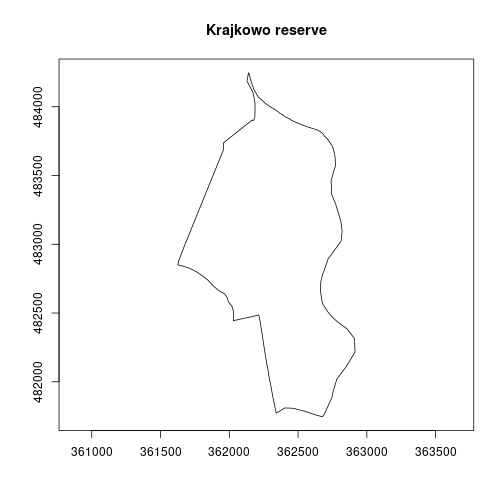
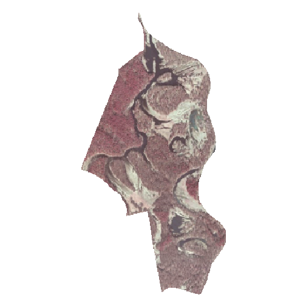
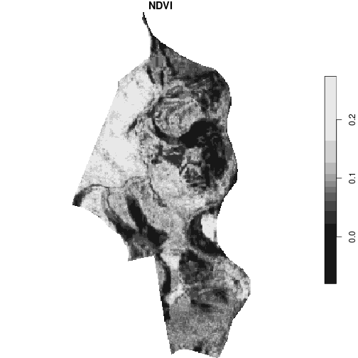

<style>
body {text-align: justify}
</style>

## Definition

**Orthophotomap** is a raster, orthogonal and cartometric representation of the terrain surface created by digital processing of aerial or satellite images.
During the orthorectification, geometric distortions resulting from the land relief are removed by using digital elevation models (DEM).
An orthophotomap is georeferenced, and therefore, allows to determine geographic coordinates for each of its cells.

Orthophotomaps' properties:

1. **Spatial resolution** - is related to the size of the smallest object that can be detected by the sensor and is determined by the size of the image cell (pixel).
The smaller the cell, the more detail it represents.
Too large a pixel means that individual objects in the scene are no longer recognizable.
2. **Composition** - analog images are in shades of gray, while digital images can be in natural colors (RGB) or near infrared (NIR).

## Purpose

The purpose of this vignette is to assess the vegetation condition of the selected area.
It can be done based on remote sensing data (multispectral orthophotomap) and a simple vegetation index.

**NDVI** (Normalized Difference Vegetation Index) is a simple indicator of vegetation that uses the red and the near infrared bands.
Its main application is monitoring and forecasting of agricultural production.
It is calculated using the following formula:

$$NDVI = \frac {NIR - RED} {NIR + RED}$$

Its value ranges from -1 to 1.
The higher the value, the higher the biomass level.
Values close to 0 and below are related to water, bare soil surfaces or buildings.

## Analysis


```r
# attach packages
library(sf)
library(stars)
library(rgugik)
```

The analysis area is the Krajkowo nature reserve located in the Greater Poland voivodeship.
It was established in 1958 in order to protect the breeding places of birds, especially the *grey heron* and the *great black cormorant*, and to protect the landscape of the Warta oxbow.

### Vector data

Data on nature reserves can be found in General Geographic Databases.
We can obtain them using the `geodb_download()` function.
Let's do that.


```r
# 17.6 MB
geodb_download("wielkopolskie", outdir = "./data")
```

If you run into any problem with the download, remember that you can pass another download method from `download.file()` as a function argument.


```r
geodb_download(req_df, outdir = "./data", method = "wget")
```

The downloaded database consists of many files in the GML (*Geography Markup Language*) format.
A brief description of the structure of this database can be found [here](https://kadyb.github.io/rgugik/articles/articles/spatialdb_description.html).
The table with the nature reserves is in the "PL.PZGIK.201.30__OT_TCRZ_A.xml" file.
We can use the **sf** package and its `read_sf()` function to load it.


```r
reserves = read_sf("data/PL.PZGiK.201.30/BDOO/PL.PZGIK.201.30__OT_TCRZ_A.xml")
```

Let's check the structure of our data.


```r
ncol(reserves)
## [1] 28
nrow(reserves)
## [1] 110
```

In simple terms, it is a spatial table consisting of 110 observations (rows) and 28 variables (columns).
The names of the objects are located in the **nazwa** column, which allow us to select the Krajkowo reserve only.


```r
# selection by attribute
krajkowo = reserves[reserves$nazwa == "Krajkowo", ]
```


We can display it in two basic ways:

1. Using the `plot()` function and directly specifying the column with the object geometry: `plot(krajkowo$geometry)`
2. Using the `plot()` and `st_geometry()` functions that obtain geometry from the vector layer.
In the first case, we need to know the name of the column with geometries (e.g. `geometry`, `geom`, etc.), while in the second case, the geometry is selected automatically (it is the safer and preferable way).


```r
plot(st_geometry(krajkowo), axes = TRUE, main = "Krajkowo reserve")
```



We can also calculate the area of this polygon.


```r
krajkowo_area = st_area(krajkowo) # [m^2]
units::set_units(krajkowo_area, "ha") # convert to [ha]
```

```
## 165.2744 [ha]
```

The `st_area()` function returned the area in m^2, and after the conversion we got the result of 165 ha.

### Raster data

Now let's move on to the stage of downloading the orthophotomap.
We use the `ortho_request()` function that show us which images are available for the analyzed area.
We need to provide our Krajkowo polygon as the argument of this function.


```r
req_df = ortho_request(krajkowo)
```

We can display the resulting table using the code below.


```r
# display the first 10 rows and the first 6 columns
req_df[1:10, 1:6]
```

```
##             sheetID year resolution composition  sensor     CRS
## 1  N-33-142-B-d-4-2 2004       0.50         B/W  Analog PL-1992
## 2  N-33-142-B-d-4-4 2004       0.50         B/W  Analog PL-1992
## 3  N-33-142-B-d-4-4 2010       0.25         RGB Digital PL-1992
## 4  N-33-142-B-d-4-2 2010       0.25         RGB Digital PL-1992
## 5  N-33-142-B-d-4-4 2010       0.25         CIR Digital PL-1992
## 6  N-33-142-B-d-4-2 2010       0.25         CIR Digital PL-1992
## 7  N-33-142-B-d-4-2 2016       0.25         CIR Digital PL-1992
## 8  N-33-142-B-d-4-2 2016       0.25         RGB Digital PL-1992
## 9  N-33-142-B-d-4-4 2016       0.25         CIR Digital PL-1992
## 10 N-33-142-B-d-4-4 2016       0.25         RGB Digital PL-1992
```

To complete our task, we need to obtain a near infrared data.
So in the next step, we select those rows for which the `composition` column has the value of "CIR".


```r
# select IR images and overwrite the req_df object
req_df = req_df[req_df$composition == "CIR", ]
```

Then let's sort the table according to the year the photo was taken, with the most recent images at the top of the table.


```r
req_df = req_df[order(-req_df$year), ]
```

Let's display the table again and select the newest compositions.


```r
req_df[, c(1:5, 9)]
```

```
##             sheetID year resolution composition  sensor seriesID
## 7  N-33-142-B-d-4-2 2016       0.25         CIR Digital    69837
## 9  N-33-142-B-d-4-4 2016       0.25         CIR Digital    69837
## 22 N-33-142-B-d-4-2 2013       0.25         CIR Digital    69903
## 24 N-33-142-B-d-4-4 2013       0.25         CIR Digital    69903
## 5  N-33-142-B-d-4-4 2010       0.25         CIR Digital    69763
## 6  N-33-142-B-d-4-2 2010       0.25         CIR Digital    69763
```


```r
req_df = req_df[req_df$year == 2016, ]
```

Note that the result has a pair of objects (images).
This means that our Krajkowo reserve is depicted in two photos within one series.
Therefore, the `seriesID` column is used to combine smaller images into a larger mosaic.


```r
req_df[, c(1:5, 9)]
```

```
##            sheetID year resolution composition  sensor seriesID
## 7 N-33-142-B-d-4-2 2016       0.25         CIR Digital    69837
## 9 N-33-142-B-d-4-4 2016       0.25         CIR Digital    69837
```

The `tile_download()` function is used to download orthophotomaps by taking our selected table as the main argument.
We can also specify the output folder with the `outdir` argument.


```r
# 61.9 MB
tile_download(req_df, outdir = "./data")
```

```
## 1/2
## 2/2
```

### Processing

Let's load the downloaded orthophotomaps using the `read_stars()` function from the **stars** package, which allows working with spatiotemporal arrays.
In our case, it is a raster consisting of three bands (NIR, R, G) for only one point in time.
We don't need to load the entire data array into memory - we can read the file's metadata instead by using the `proxy` argument.


```r
img1 = read_stars("data/69837_329609_N-33-142-B-d-4-2.TIF", proxy = TRUE)
img2 = read_stars("data/69837_329613_N-33-142-B-d-4-4.TIF", proxy = TRUE)
```

Now we can perform two operations: rasters merging and cropping to the reserve area.
The use of a `proxy` allows to get the result almost immediately, while processing the entire image (`proxy = FALSE`) would take several minutes.
Images have their own specific Coordinate Reference Systems, so let's make sure it is the correct one after merging.
It should be EPSG 2180 in this case.


```r
img = st_mosaic(img1, img2)
st_crs(img) = 2180 # overwrite CRS to be sure
img = st_crop(img, krajkowo)
```


Let's display the effect using the `plot()` function, and define the input bands with the `rgb` argument.
It creates a composition consisting of three bands: NIR, R and G in our case.
The composition below is shown in infrared, not in natural colors, which may be misinterpreted from the `rgb` argument name.


```r
plot(img, rgb = c(1, 2, 3), main = NULL)
```



In the last step, we calculate the NDVI using the near infrared (1) and red (2) bands.


```r
calc_ndvi = function(img) (img[1] - img[2]) / (img[1] + img[2])
ndvi = st_apply(img, MARGIN = c("x", "y"), FUN = calc_ndvi)
plot(ndvi, main = "NDVI", col = hcl.colors(10, palette = "RdYlGn"))
```



A surprising observation is the relatively low NDVI values for the forest area.
There are two reasons for this, i.e. the photos are taken in mid-March (before the start of the growing season) and probably have not been calibrated.
For this reason, a better source of data for analysis may be satellite images, which are calibrated spectrally and obtained continuously (if no cloudiness occurs).


