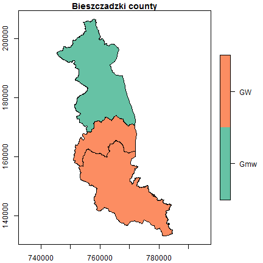
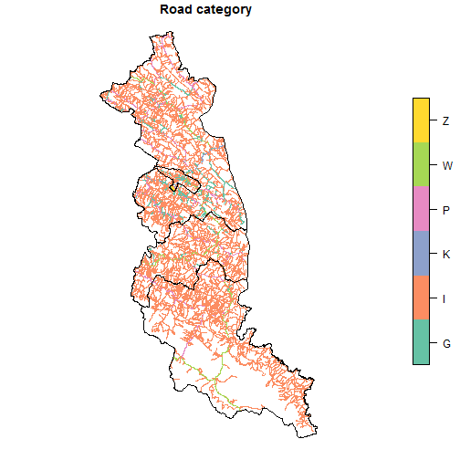
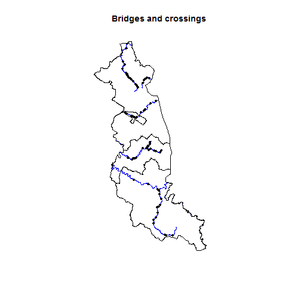
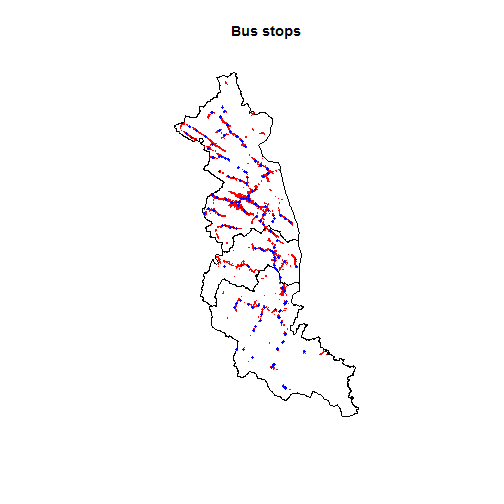
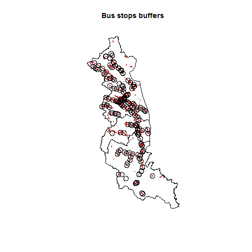

<style>
body {text-align: justify}
</style>

## Definition

**Topographic Database** (*Baza Danych Obiektów Topograficznych*) is a vector (object) database containing the spatial location of topographic objects with their characteristics.
The content and detail of the database corresponds to the topographic map in the scale 1:10000.
The thematic scope includes, among others, information on: water network, communication network, land cover, buildings, technical structures, land use, protected areas, territorial division units.
The database is available in the Geography Markup Language (GML) format.
The source of its data comes from:

- other spatial databases maintained by Polish Head Office of Geodesy and Cartography (e.g. *Register of Towns, Streets and Addresses*, *Register of Land and Buildings*, *State Register of Borders*), 
- databases maintained by other ministries or institutions (e.g. Ministry of Infrastructure, State Water Management, General Directorate for Environmental Protection),
- fieldworks.

## Purpose

The purpose of this exercise is to perform spatial operations on vector data from the database.
We will focus on four cases, taking into account point, line and polygon data and their attributes.
In addition, we will show you how they can be visualized.

## Analysis


```r
# load packages
library(sf)
library(rgugik)
```

Our analysis area is *bieszczadzki* county located in the Subcarpathian (*podkarpackie*) voivodeship.
It is the farthest area in the south of Poland and has the lowest population density (19 people on km^2^).

### Database

We will download the topographic database for our county using the `topodb_download()` function.


```r
# 22.4 MB
topodb_download("bieszczadzki", outdir = "./data")
```

The downloaded database consists of many files in the *Geography Markup Language* format.
All the necessary data for analyzes can be found in `data/PL.PZGiK.332.1801/BDOT10K/` location.
A brief description of the structure of this database can be found [here](https://kadyb.github.io/rgugik/articles/articles/geodb_description.html).

First, let's load the file with administrative units (*PL.PZGiK.332.1801__OT_ADJA_A.xml*), using the **sf** package and its `read_sf()` function.


```r
territory = read_sf("data/PL.PZGiK.332.1801/BDOT10K/PL.PZGiK.332.1801__OT_ADJA_A.xml")
```

The file contains administrative units at various levels, let's choose the lowest level, i.e. communes.
There are three types of communes: urban (*GM*), rural (*GW*) and urban-rural (*Gmw*).
Their type is specified in `rodzaj` column.
Let's select them.


```r
communes = territory[territory$rodzaj %in% c("GM", "GW", "Gmw"), "rodzaj"]
table(communes$rodzaj)
```

```
## 
## Gmw  GW 
##   1   2
```
We can see that *bieszczadzki* county consists of two rural communes and one urban-rural commune.
Let's visualize it.


```r
plot(communes, axes = TRUE, main = "Bieszczadzki county")
```



### Length and category of roads

In the first task, we will calculate the lengths of roads taking into account their categories.
Road data can be found in the *PL.PZGiK.332.1801__OT_SKDR_L.xml* file.


```r
roads = read_sf("data/PL.PZGiK.332.1801/BDOT10K/PL.PZGiK.332.1801__OT_SKDR_L.xml")
```

Let's plot them.


```r
plot(roads["katZarzadzania"], main = "Road category", reset = FALSE)
plot(st_geometry(territory), add = TRUE)
```



We have 6 road categories related to the managing entity.
Those are: national (K), voivodeship (W), county (P), communal (G), institutional (Z) and other (I).

We'll use the `st_length()` function to find the length of each object in the table.
Next, we will create a data frame consisting of the road category and its length.
Then we aggregate this data frame and calculate the sum of the lengths for each category.


```r
length_roads = st_length(roads)
length_roads = data.frame(length = length_roads,
                          class = as.factor(roads$katZarzadzania))
length_roads = aggregate(length ~ class, data = length_roads, FUN = sum)
```

The results are given in meters.
Let's convert them into kilometers.


```r
# convert to [km]
length_roads$length = units::set_units(length_roads$length, "km")
length_roads$length = round(length_roads$length)
```

Let's change the names of the categories.


```r
road_class = c("communal", "other", "national", "county", "voivodeship",
               "institutional")
levels(length_roads$class) = road_class
```

Now we can see the results.


```r
length_roads
```

```
##           class    length
## 1      communal  186 [km]
## 2         other 2820 [km]
## 3      national   19 [km]
## 4        county  187 [km]
## 5   voivodeship  106 [km]
## 6 institutional   10 [km]
```

Other type of roads dominates, which consists mainly of non-public roads.


```r
sum(length_roads$length)
```

```
## 3328 [km]
```

The total sum of the road lengths is 3328 km.
We can also calculate the density of the road network.


```r
communes_area = sum(st_area(communes))
communes_area = units::set_units(communes_area, "km2")
density = sum(length_roads$length)/communes_area
density = units::set_units(density, "km/km2")
density = round(density, 2)
density
```

```
## 2.92 [km/km2]
```
The road density is 2.92 km/km^2^.

### Roads through the rivers

Let's also load the file with rivers (*PL.PZGiK.332.1801__OT_SWRS_L.xml*).


```r
rivers = read_sf("data/PL.PZGiK.332.1801/BDOT10K/PL.PZGiK.332.1801__OT_SWRS_L.xml")
rivers = rivers[rivers$rodzaj == "Rz", ] # select only rivers
```

Rivers are divided into smaller sections with different parameters (river width, data source).
Let's merge the same rivers into one object (geometry).
We will use the attribute with ID (`idMPHP`) to merge.
Then we will give them a new sequence number from 1 to n as the category.


```r
rivers = aggregate(rivers[, c("geometry", "idMPHP")],
                   list(rivers$idMPHP),
                   sum)
rivers$idMPHP = seq(1, length(unique(rivers$idMPHP)))
rivers$idMPHP = as.factor(rivers$idMPHP)
```

Let's visualize their course.


```r
plot(rivers["idMPHP"], main = "Rivers", reset = FALSE)
plot(st_geometry(territory), add = TRUE)
```


With rivers and roads, we can designate points of intersection that will symbolize bridges and crossings.
We will use the `st_intersection()` function for this.


```r
bridges = st_geometry(st_intersection(rivers, roads))
length(bridges)
```

```
## [1] 81
```

We get 81 such points.
Let's plot them.


```r
plot(st_geometry(rivers), main = "Bridges and crossings", col = "blue")
plot(st_geometry(territory), add = TRUE)
plot(bridges, add = TRUE, pch = 20)
```




### Land cover

Let's check the land cover in our county.
The land cover data is contained in files named PT.
We will use the `list.files()` function to list them.
The `pattern` argument is important because it determines what files should be selected.
Our `pattern` should look like this: `PT+.+A\\.xml$`.
Only files containing area (A) land cover (PT) will be listed.


```r
files = list.files("data/PL.PZGiK.332.1801/BDOT10K",
                   pattern = "PT+.+A\\.xml$",
                   full.names = TRUE)
files_name = list.files("data/PL.PZGiK.332.1801/BDOT10K",
                        pattern = "PT+.+A\\.xml$")
files_name
```

```
##  [1] "PL.PZGiK.332.1801__OT_PTGN_A.xml"
##  [2] "PL.PZGiK.332.1801__OT_PTKM_A.xml"
##  [3] "PL.PZGiK.332.1801__OT_PTLZ_A.xml"
##  [4] "PL.PZGiK.332.1801__OT_PTNZ_A.xml"
##  [5] "PL.PZGiK.332.1801__OT_PTPL_A.xml"
##  [6] "PL.PZGiK.332.1801__OT_PTRK_A.xml"
##  [7] "PL.PZGiK.332.1801__OT_PTSO_A.xml"
##  [8] "PL.PZGiK.332.1801__OT_PTTR_A.xml"
##  [9] "PL.PZGiK.332.1801__OT_PTUT_A.xml"
## [10] "PL.PZGiK.332.1801__OT_PTWP_A.xml"
## [11] "PL.PZGiK.332.1801__OT_PTWZ_A.xml"
## [12] "PL.PZGiK.332.1801__OT_PTZB_A.xml"
```

Let's exclude *PL.PZGiK.332.1801__OT_PTSO_A.xml* file from list, because there are no objects.


```r
# drop "OT_PTSO_A.xml"
files = files[-7]
files_name = files_name[-7]
```

Let's prepare the names of the objects to which the data will be loaded.


```r
layers = c("fallowlands", "communication", "forest", "undeveloped",
           "squares", "shrublands", "crops", "grassland",
           "water", "heaps", "buildings")
```

Now iteratively we will load each GML file, naming it from the list above.


```r
for (i in seq_len(length(files))) {
  assign(layers[i], read_sf(files[i]))
}
```

Previously, we used `st_length()` to calculate the line length, there is corresponding `st_area()` function to calculate the area.
For each object (layer) we have to calculate its area separately, so we will do it in a loop.


```r
# initialize empty vector
area_landcover = integer()

for (i in seq_len(length(layers))) {
  area_tmp = st_area(eval(as.name(layers[i])))
  area_tmp = sum(area_tmp)
  
  # add result from the current iteration to the vector
  area_landcover = c(area_landcover, area_tmp)
}

# convert units
area_landcover = units::set_units(area_landcover, "m^2")
area_landcover = units::set_units(area_landcover, "km^2")
names(area_landcover) = layers
```

Let's see the results (in kilometers).


```r
area_landcover
```

```
## Units: [km^2]
##   fallowlands communication        forest   undeveloped       squares 
##    0.07561383    1.97014481  860.17248134    0.27817715    0.29038385 
##    shrublands         crops     grassland         water         heaps 
##    1.57266555  255.13528884    0.63447491    8.81181550    0.09220115 
##     buildings 
##   10.38781092
```

Let's make sure that the total land cover is equal to the area of our county.
There will be some precision geometry differences so we should set the difference tolerance.
This is possible in the `all.equal()` function.


```r
isTRUE(all.equal(sum(area_landcover), communes_area, tolerance = 0.001))
```

```
## [1] TRUE
```

Everything is correct.
Let's present the results as a percentage and sort them in descending order.


```r
landcover_percentage = area_landcover/sum(area_landcover)*100
units(landcover_percentage) = NULL # drop units
landcover_percentage = round(landcover_percentage, 2)
landcover_percentage = sort(landcover_percentage, decreasing = TRUE)
landcover_percentage
```

```
##        forest         crops     buildings         water communication 
##         75.49         22.39          0.91          0.77          0.17 
##    shrublands     grassland       squares   undeveloped   fallowlands 
##          0.14          0.06          0.03          0.02          0.01 
##         heaps 
##          0.01
```

Over 75% of the county's area is covered by forests and only less than 1% by buildings.


### Buffer

The last type of analysis will be based on the spatial buffer.
We will check how many buildings have access to bus stops within a given distance.
Information about bus stops can be found in the *PL.PZGiK.332.1801__OT_OIKM_P.xml* file.
Bus stops take the *OIKM04* value of the `x_kod` attribute.


```r
bus_stop = read_sf("data/PL.PZGiK.332.1801/BDOT10K/PL.PZGiK.332.1801__OT_OIKM_P.xml")
bus_stop = bus_stop[bus_stop$x_kod == "OIKM04", ]
```

Let's prepare a visualization in which the bus stops will be marked with blue dots and the buildings as red polygons.


```r
plot(st_geometry(communes), main = "Bus stops")
plot(st_geometry(buildings), add = TRUE, border = "red")
plot(st_geometry(bus_stop), add = TRUE, pch = 20, cex = 0.7, col = "blue")
```



Let's create a buffer of bus stops with a range of 1 km using `st_buffer()`.


```r
bus_buffer = st_buffer(bus_stop, 1000)
```

Let's plot it all.


```r
plot(st_geometry(communes), main = "Bus stops buffers")
plot(st_geometry(buildings), add = TRUE, border = "red")
plot(st_geometry(bus_buffer), add = TRUE)
```



Now we perform a spatial operation that will return the buildings within the buffer range.


```r
buildings_buffer = st_within(buildings, bus_buffer)
```

The result is a nested list that consists of 2828 buildings and their associated buffers.
Let's count how many buildings are not in any buffer.
Function `sapply()` will be useful for operations on lists.


```r
buildings_ex = sapply(buildings_buffer, length)
buildings_ex = sum(buildings_ex == 0)
buildings_ex = round(buildings_ex / nrow(buildings) * 100)
buildings_ex
```

```
## [1] 14
```

14% of the buildings do not have access to a bus stop within 1 km.


